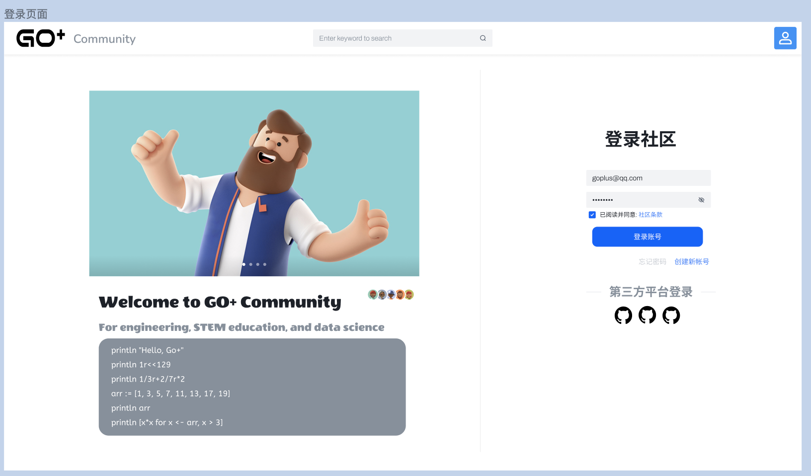
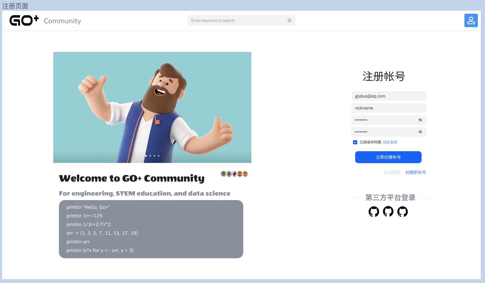
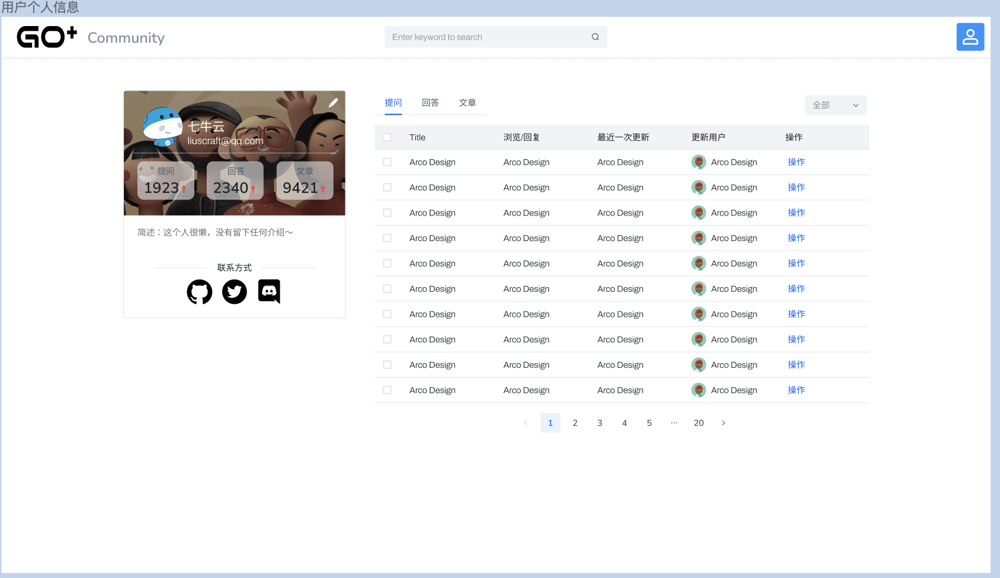
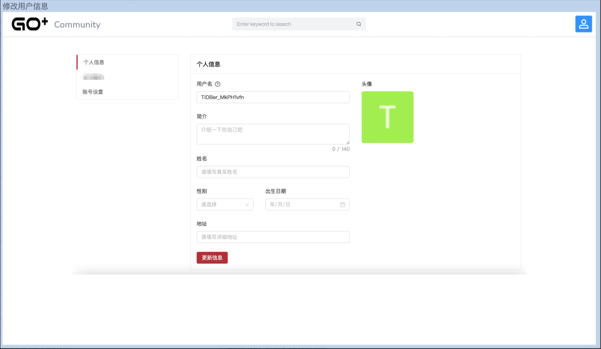
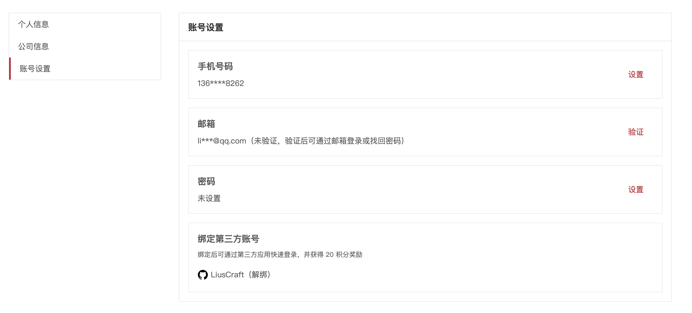
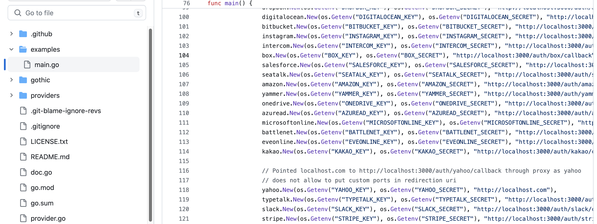

# Account subsystem Product Design

# 登录/注册

## Sign in with GitHub：第三方平台登录

> **第三方账号登录时需检查是否绑定社区帐号，需强制让用户绑定，若没有需注册**
> 入口在登录页面》登录表单底部

第三方登录：GitHub

帐号：在社区通过邮箱注册的帐号

登录后检查用户是否创建了帐号，如果未创建需让用户创建账号

第三方登录，未创建账号，就自动获取第三方账号的基本信息：邮箱当作账号、username 当作账号名、nickname 当作账号昵称自动填充到注册表单中，用户仅仅只需要点击[创建按钮](https://hxfoszvibov.feishu.cn/docx/SEJNdMHRtoxHvMxHvjkc7ezlnfj#part-Z4aRdI7eVoFMZfxsA7ZcWzWsnVd)[完成注册](https://hxfoszvibov.feishu.cn/docx/SEJNdMHRtoxHvMxHvjkc7ezlnfj#part-Z4aRdI7eVoFMZfxsA7ZcWzWsnVd)。

### 原型图

### 原型图描述

第三方登录按钮在登录表单底部，目前只有 GitHub、微信 图标按钮

### 交互流程

用户点击第三方平台的图标后在新的标签页进入到第三方平台的授权页面进行授权。

授权通过后返回登录页面校验是否授权成功，未成功则提示授权失败，否则如下。

1. 检查是否绑定社区帐号，如果绑定自动登录该帐号。
2. 未绑定则进入注册页面，告知用户需要注册社区帐号，如果可以获取到邮箱地址以及网络昵称则自动填充到注册表单的相对应的输入框中（否则需要用户自己完善）， 密码需要用户自己输入。
3. 用户完成注册后会自动关联当前授权的第三方平台（绑定第三方的平台帐号）

### 技术分析

考虑到多个第三方平台绑定登录，这里调研了几个框架：[go-OAuth2.0](http://golang.org/x/oauth2)、[goth](https://github.com/markbates/goth)、[thirdparty](https://github.com/geiqin/thirdparty)

| 框架名      | 支持平台                                 |
| ----------- | ---------------------------------------- |
| goth        | all                                      |
| third party | QQ、微信、微信小程序、微博、抖音、支付宝 |

## 社区帐号邮箱登录

> 需要通过社区的注册功能获得帐号登录。
> 已登录用户访问该页面时自动访问到社区首页

### 原型图

涉及字段： 邮箱地址、帐号密码

### 原型图描述

该原型图中是使用社区帐号登录 。

表单输入项：

1. 社区帐号邮箱地址输入框
2. 社区帐号密码输入框
3. 社区相关条款同意选择框
4. 登录按钮
5. 进入到忘记密码页面的超链接
6. 进入到创建帐号页面的超链接
7. 可选择第三方登录方式去登录的图标

### 交互流程

#### 表单交互

1. 用户输入邮箱，输入邮箱域名
2. 用户输入帐号密码
3. 用户阅读相关条款后需勾选同意条款
4. 用户 1-3 步骤完成后即可点击登录按钮进行登录

#### 超链接交互

忘记密码：点击后当前页跳转到忘记密码页面。

立即创建帐号：点击后当前页面跳转到创建帐号页面。

更多登录方式：点击第三方登录图标后新的标签页打开相关平台的授权页面进行授权登录社区。

## 社区帐号邮箱注册

用户在没有帐号的情况下需要通过邮箱去注册帐号，

### 原型图

### 原型图描述

该页面用于注册帐号

元素项：

1. 邮箱输入框
2. 昵称输入框
3. 密码输入框
4. 密码输入确认框
5. 社区条款同意框
6. 注册按钮
7. 忘记密码按钮
8. 已有帐号按钮

### 交互流程

#### 表单交互

1. 输入邮箱地址，检查邮箱是否合规，不合规则气泡提示
2. 输入昵称，检查昵称是否合规，不合规则气泡提示
3. 输入密码，用于登录，检查密码安全性（大小写加数组，长度大于等于 8）
4. 再次输入密码，要与第一次输入的相同，确认用户输入的密码是否是他期望的。
5. 用户需阅读条款并同意后可点击注册按钮
6. 点击注册按钮弹出验证框，用户验证后给邮箱发送激活链接，激活账号。

# 帐号信息

## 获取用户信息

### 原型图

个人信息、用户发布的内容信息

### 原型图描述

1. 点击右上角头像进入这个页面
2. 左边卡片内包含用户头像、昵称、邮箱、简述、用户的内容统计（文章、回答、提问）、联系方式（可自定义关联的图标链接按钮）、修改用户信息按钮
3. 右边由三种文章组成：提问文章、回答文章（回答提问文章）、普通文章、文章状态筛选器、文章结果列表
4. 文章状态筛选器

   1. 提问文章可筛选：已解决、待解决、关注-已解决、关注-未解决、全部
   2. 回答文章可筛选：被采纳、未被采纳、关注、全部
   3. 普通文章可筛选：已发布、草稿、被退回、全部
5. 文章结果列表：根据文章类型、文章状态的筛选后得到的结果显示在列表中

   1. 列表包含字段：文章标题、浏览/回复、最近一次更新时间、更新用户、操作按钮
   2. 最近一次更新和更新用户：显示文章或评论最新的一次发布（新增、编辑都算）
   3. 操作按钮：删除文章、退稿（已退稿的不显示该按钮）、编辑
   4. 分页按钮：用于切换当前查询条件下的结果集分页。

### 交互流程

1. 联系方式的图标按钮：用户点击后会在新的标签页里打开引用的网址
2. 左边修改用户信息的图标（🖊）按钮：只能用户本人可看见，点击后跳转到修改用户信息的页面
3. 右边 tab 栏中的文章类按钮：点击后切换查询文章的类型，提问、回答、文章，并触发查询操作更新列表
4. 右边文章状态筛选器下拉框：默认是筛选全部，若变更了筛选则自动触发查询操作更新列表
5. 列表的文章多选可显示多选操作：删除、退稿、重新发布
6. 列表项中单个操作按钮：弹出菜单可选择删除文章、退稿（已退稿的不显示该按钮）、编辑操作，对当前文章项操作。
7. 文章项点击：可跳转到该文章预览页面。
8. 分页按钮：更换页号、行数时触发查询操作更新列表

## 修改用户信息

### 原型图

### 原型图描述

左边是修改的信息类型 tab 栏：个人信息、账号设置

当前页就是个人信息的修改项列表

可修改项：

用户名（昵称）：文本输入框

简介：多行文本输入框（不是必填）

姓名（真实姓名设置）：文本输入框（不是必填项），设置后昵称后会跟上真实姓名，并显示实名图标，用于一些认证上的表示。

性别：下拉选择框，男、女、保密。默认是保密（思考过国际化带来的开放性，但是按照性别真正的定义这三个选项足够了）

出生日期：日期选择器，内容：年-月-日(不是必填)

地址：文本输入框（不是必填项）

头像：图片显示，修改头像的按钮

### 交互流程

用户登录了才能访问该页面，并且只能用户访问自己的修改信息

用户点击修改按钮会直接进入该页面，左边也可以点击个人信息按钮切换到该页面。

右边则显示可修改的内容。

用户鼠标悬浮在头像图片上会显示半遮罩效果上面会显示设置头像文字，点击头像图片可弹出图片文件选择窗口，用户选择了并确认了后则直接修改头像。

按钮：更新信息，该按钮只是用来更新表单内容的信息，头像不会因它更新。更新成功后提示更新成功

## 第三方账号绑定与账号信息修改

### 原型图

### 原型图描述

左边是修改的信息类型 tab 栏：个人信息、账号设置

当前页就是账号设置的修改项列表

可修改项：

绑定的手机号、邮箱地址、密码、绑定第三方账号

手机号：当前设置的手机号信息，信息过敏后显示，通过设置按钮设置

邮箱：当前设置的邮箱信息，信息过敏后显示，通过设置按钮设置

密码：仅显示密码是已设置还是未设置的状态，通过设置按钮设置

绑定第三方平台张：列出可绑定的第三方平台平台名旁显示：解绑或绑定按钮

最底部提供注销账号按钮

### 交互流程

手机号设置：需通过密码、邮箱验证码，只能设置一个手机号

邮箱设置：修改需要通过密码、邮箱验证码，只能设置一个邮箱

密码设置：修改需要输入旧密码或邮箱验证码，只能设置一个密码

绑定账号：绑定账号需选择绑定的平台，然后进行绑定，需注意账号平台通过后台去添加允许与哪些平台绑定（管理员后台）

最底部的注销账号按钮：点击后弹出提示框，告知注销会对账号做什么， 对用户带来什么样的影响，告知一切结果，最终用户阅读并同意知晓后才可继续注销，这时需要用户校验身份，邮箱验证。通过后用户客户端退出登录。

# 调研

**gopath：  （选它）**

完整的例子，支持的三方多

**third party：**

个人开发，star 少，不考虑

# 功能设计

使用 gopath 作为第三方登录库，原因是支持很多平台，并且有丰富的例子，开发者只需要替换对应的 id 和密钥即可

## 流程

## 风险评估

| 技术风险     | 在实现直接第三方登录时需要考虑与账号绑定的业务流程。                                     |
| ------------ | ---------------------------------------------------------------------------------------- |
| 时间风险     | 1 周内                                                                                   |
| 成本风险     | 无                                                                                       |
| 用户体验风险 | 用户第一次直接通过第三方平台登录平台（无账号的状态下）让用户体验到快速注册登录的便捷性。 |
| 安全风险     | 较小                                                                                     |
| 集成风险     | 无                                                                                       |
