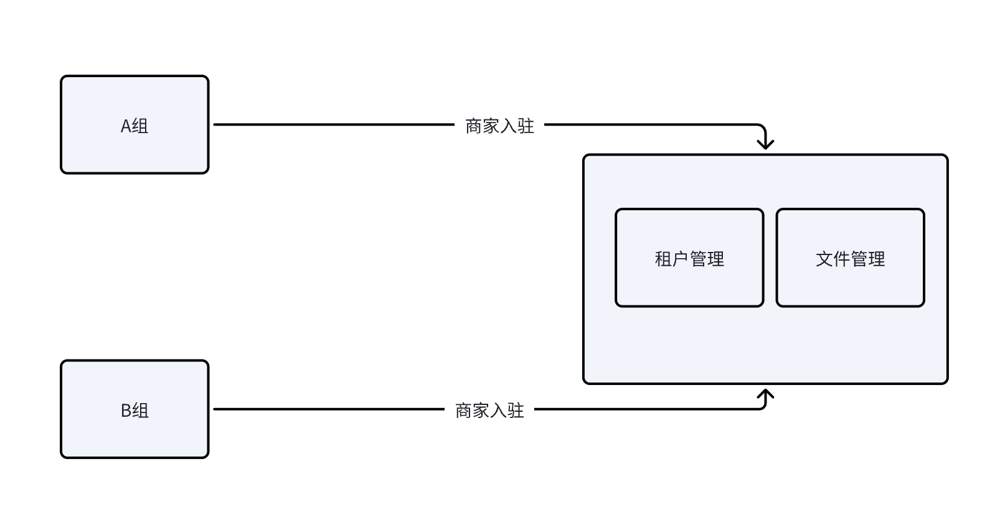

# 功能设计
文件需要在文章/评论/B Team中使用，因此设计为中台。

交互方式：利用uuid进行交互，不需要加密算法（因部署在内网）
## 技术栈
Gin + gorm + mysql + 七牛云oss
## 传输选型
1.http

提供http接口文档或者sdk，文档简单，脱离sdk也可以使用

2.sdk

需要双方制定协议，或者平台提供sdk给使用方，虽然传输效率快，但是复杂度高。

在这个场景下不需要传输效率快，因为是异步的方式，并且没有大文件，所以使用http即可
# 交互流程


风险评估

| 技术风险 | 如果文件过大则需要断点续传 |
| --- | --- |
| 时间风险 | 无 |
| 成本风险 | 需要提前和租户制定好字段以及API接口，避免后期频繁更改 |
| 用户体验风险 | 用户只需要使用sdk方式即可调用 |
| 安全风险 | 中台服务部署在内网，不会出现请求拦截问题，因此不需要数据加密等 |
| 集成风险 | 七牛云oss |

# 结构体
**租户**
```
type merchant struct{
    id int
    name string
    description string
    state bool
    fileSize long // 文件容量限制，暂时不需要，可以留着
    allowedFileTypes string // 文件请求限制
    gmtCreateAt time.Time
    gmtUpdateAt time.Time
    isDeleted bool
}
```
**文件**
```
type file struct{
    id int
    key string
    name
    format string
    size long
    merchantId int
    url string 
    extra string
    gmtCreateAt time.Time
    gmtUpdateAt time.Time 
}
```
七牛云oss todo
# API
