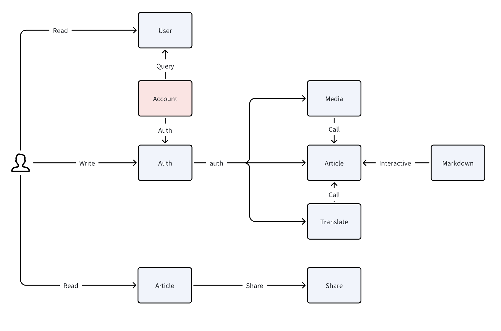

# Go+ Community Architecture

## Architecture Overview

Go+ Community is a community for Go+ developers. It provides a platform for developers to share their knowledge and experience, and to communicate with each other.It contains the following modules:

### Module Boundaries

1. **Account Module**: (/internal/core/account)
   - Description: Handles user login and logout operations.
   - Interfaces: Includes user login interface (input username and password, output login result and user information), user logout interface (input user information, output logout result), etc.
   - Behavior: Processes user login and logout requests, validates user information, maintains user login status, etc.

2. **Article Package**: (/internal/core/community)
   - Description: Responsible for article creation, reading, updating, and deletion (CRUD) operations.
   - Interfaces: Includes create article interface (input article information, output creation result and article ID), read article interface (input article ID, output article information), update article interface (input article ID and new article information, output update result), delete article interface (input article ID, output deletion result), etc.
   - Behavior: Handles article CRUD requests, maintains article status, provides article search and sorting functions, etc.

3. **Markdown Component**: (/cmd/gopcomm/yap)
   - Description: Provides Markdown editor functionality.
   - Interfaces: Includes input for Markdown text, output for rendered HTML text, etc.
   - Behavior: Converts Markdown text into HTML text, provides text editing and preview functions, etc.

4. **Translate Package**: (/translation)
   - Description: Responsible for the translation of Markdown text and videos.
   - Interfaces: Includes translation interface (input Markdown text or video, output translated text or video), etc.
   - Behavior: Handles translation requests, calls third-party translation services, returns translation results, etc.

5. **Media Package**: (/internal/core/media)
   - Description: Responsible for media file management.
   - Interfaces: Includes upload media file interface (input media file, output upload result and file URL), delete media file interface (input file URL, output deletion result), etc.
   - Behavior: Handles media file upload and deletion requests, maintains media file status, provides file search and sorting functions, etc.

6. **Share Component**: (/cmd/gopcomm/yap)
   - Description: Provides the function to share to Twitter or Facebook.
   - Interfaces: Includes share interface (input share content and target platform, output share result), etc.
   - Behavior: Handles share requests, calls Twitter or Facebook's share API, returns share results, etc.

7. **Web Module**: (/cmd/gopcomm/yap)
   - Description: Provides Web interface.
   - Interfaces: Includes various Web pages (such as home page, article page, login page, etc.).
   - Behavior: Responds to user requests, renders Web pages, provides user interaction functions, etc.

### Module Interaction

- Account Module and Web Module: The Web Module might call interfaces from the Account Module to handle user login and logout requests. For instance, when a user clicks the login button on the web interface, the Web Module would invoke the login interface from the Account Module.

- Article Package and Markdown Component: When a user is editing an article, the Article Package might utilize the Markdown Component to provide Markdown editing functionality. For example, when a user inputs Markdown text in the article editor, the Article Package would call an interface from the Markdown Component to convert the Markdown text into HTML.

- Article Package and Media Package: When a user inserts media files (such as images or videos) into an article, the Article Package might call interfaces from the Media Package to upload and manage these files.

- Translate Package and Article Package: When a user needs to translate an article, the Translate Package might call interfaces from the Article Package to retrieve the article content for translation.

- Share Component and Article Package: When a user wants to share an article to Twitter or Facebook, the Share Component might call interfaces from the Article Package to get the article's URL, and then call the APIs from Twitter or Facebook for sharing.

## Architecture Design

Community is a web application based on `yap`, the interaction of each module is as follows:

The main interaction process is as surrouned by user interaction.

User info is stored in the database, and the user info is used to verify the user's login status and parse the user info. And get the OAuth login authentication information from github twitter facebook and store the user information temporarily in a cookie.

The article module is the core of the goplus community, and it not only connects the user module, but also integrates the article translation and resource upload module. User can create, update, delete and query articles when they login, then the article will be stored in the database. The article operation involves the storage of HTML files, it also needs to be connected to Qiniu cloud storage.

The markdown component is used to edit the article, support markdown syntax and preview. Especially, our markdown editor supports goplus syntax highlighting, markdown translation and video translation, easy to paste pictures and videos.

The share component is used to share the article to Twitter or Facebook.

The Media package is used to manage resources to the cloud storage(QiNiu Cloud Storage). It can upload, delete and query resources.

The web module is the front-end of the community, which is used to display the community interface. It is based on yap template.

## Module list

- [Account Module](./02_account_module.md)
- [Article Package](./03_article_package.md)
- [Markdown Component](./04_markdown_component.md)
- [Translate Package](./05_translation_package.md)
- [Share Component](./06_share_component.md)
- [Media Package](./07_media_package.md)
- [Web Module](./08_web_module.md)
