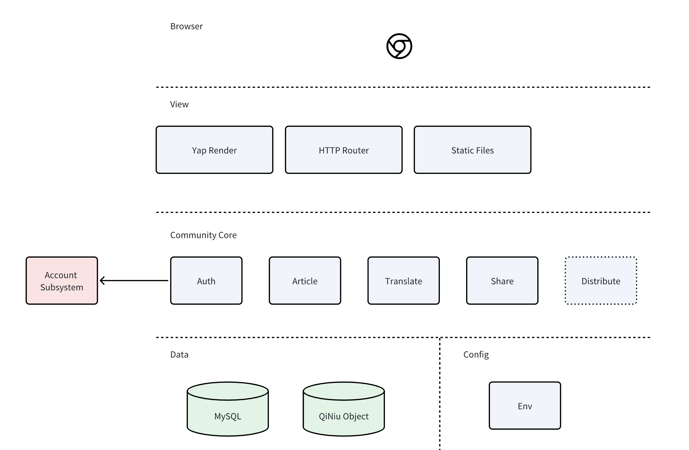

# Go+ Community Architecture

## Architecture Overview

Go+ Community is a community for Go+ developers. It provides a platform for developers to share their knowledge and experience, and to communicate with each other.It contains the following modules:

- Account Module
- Article Module
- Markdown Module
- Translate Module
- Share Module
- Web Module

## Architecture Design

Community is a web application based on `yap`, 

## Module list

- [Account Module](./02_account_module.md)
- [Article Module](./03_article_module.md)
- [Markdown Module](./04_markdown_module.md)
- [Translate Module](./05_translation_module.md)
- [Share Module](./06_share_module.md)
- [Web Module](./07_web_module.md)
