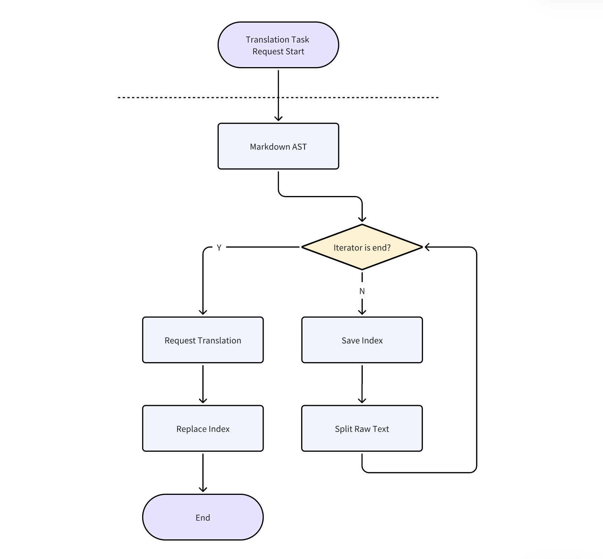

# Translation module

## Module purpose

This module is used to translate the multilingual markdown file into english version.

## Module scope

This module get raw markdown file from input, and translate it into english version with the help of [Niu Translation API](niutrans.com).

## Module structure



When the request translation starts, it will facilitate the text position and start-stop Index of each node in markdown, split the text with random separators, send it to markdown translator, and finally restore the obtained results to the text according to Index.

## Module Interface

None.

## Functions

### TranslatePlainText

- Function: Translate text
- Input: text, from language, to language
- Output: Translated text
- Error: None

Example:

```go
func TestTranslatePlainText(t *testing.T) {
	tests := []struct {
		src  string
		from language.Tag
		to   language.Tag
	}{
		{"你好", language.Chinese, language.English},
		{"hello", language.English, language.Chinese},
	}

	trans := translation.New(mockKey, "", "")
	for _, test := range tests {
		to, err := trans.TranslatePlainText(test.src, test.from, test.to)
		fmt.Println(to, err)
		if err != nil {
			t.Fatal(err)
		}
	}
}
```

### TranslateMarkdown

- Function: Translate markdown file
- Input: Markdown file, from language, to language
- Output: Translated markdown file
- Error: None

Example:

```go
func TestTranslateMarkdown(t *testing.T) {
	tests := []struct {
		src  string
		from language.Tag
		to   language.Tag
	}{
		{`
# Heading

## 这是一个二级标题

这是一段普通的文本。

这是一段*粗体*的文本。

这是一段**粗体**的文本。

这是一段***粗斜体***的文本。

这是一段` + "`" + `行内代码` + "`" + `。

这是一段代码块：

` + "```" + `go
func main() {
	fmt.Println("Hello, World!")
}
` + "```" + `

这是一个列表：

- 列表项 1
- 列表项 2
	- 列表项 2.1
	- 列表项 2.2
- 列表项 3

这是一个有序列表：

1. 列表项 1
2. 列表项 2
	1. 列表项 2.1
	2. 列表项 2.2
3. 列表项 3

这是一个引用：

> 这是一段引用。

这里一个缩进代码块：

	func main() {
		fmt.Println("Hello, World!")
	}

这是一段[链接](https://www.example.com)

这是一段
`, language.Chinese, language.English},
	}

	trans := New(mockKey, "", "")
	for _, test := range tests {
		translatedResult, err := trans.TranslateMarkdownText(test.src, test.from, test.to)
		fmt.Println(translatedResult, err)
		if err != nil {
			t.Fatal(err)
		}
	}
}
```

### VideoToText

- Function: Convert video to text
- Input: Video file url
- Output: Text
- Error: None


Example:

```go
func TestVideo2Text(t *testing.T) {
	e := New("", mockAccessKey, mockSecretKey)
	resp, err := e.Video2Text("http://test.com/test.mp4", "http://test.com/callback")
	if err != nil {
		t.Fatal(err)
	}
	t.Log(resp)
}
```