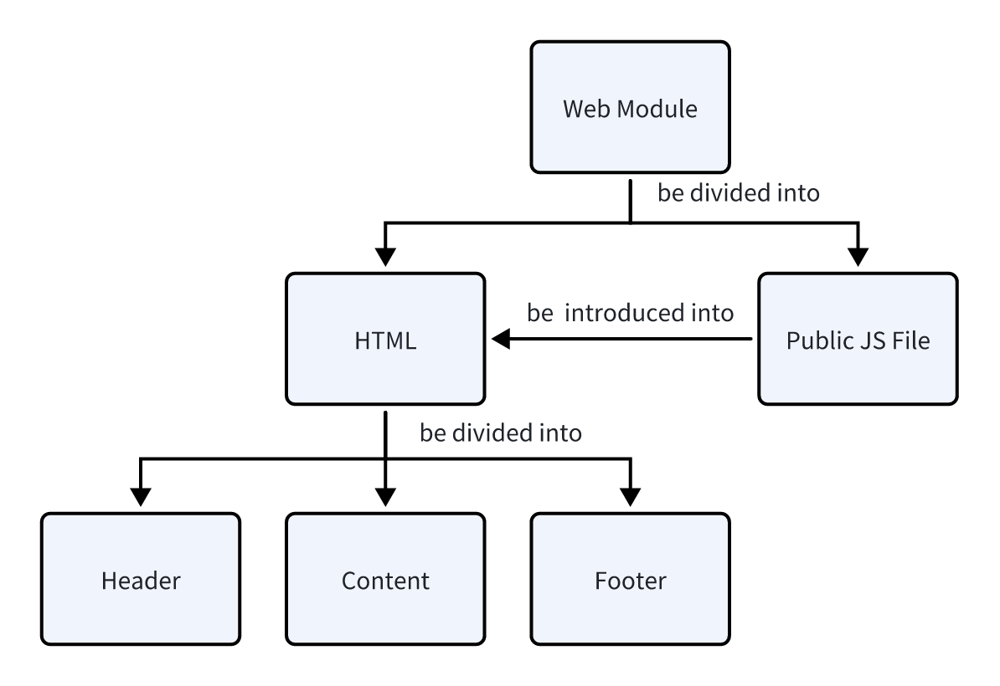

# Web module

## Module purpose

This module is used to connect web front-end static pages to form an overall website.

## Module scope

This module uses yap to parse HTML, and renders data on the website pages.

## Module structure

The whole module can be divided into two kind of files - HTML file and public JS file, and public JS file can be introduced through the `src` attribute of the `<script>` tag into each HTML file, so that the latter can obtain the vue.runtime.js. What's more, each HTML file can be divided into three kinds of components - header, content and footer.

## Module Interface

None.

## Functions

None.